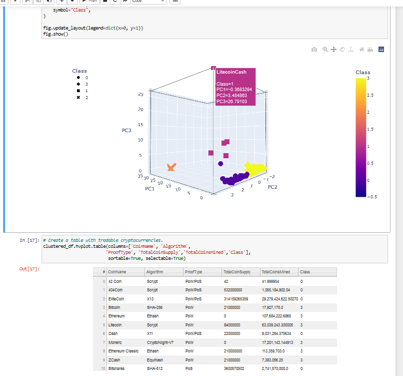

# Cryptocurrencies
# Project Overview

In this module, we were tasked with helping Martha analyze the cryptocurrency market.  Since we are not looking for a specific output, we have decided to focus on unsupervised machine learning to find out if the data can tell us something.      

## *Purpose*
The purpose of this project was to potentially provide a new cryptocurrency investment portfolio to the customers of an investment bank using unsupervised machine learning and a clustering algorithm. 

# Results / Summary 

* First, the required dependencies were imported. 

* Pandas and Jupyter notebook were then used to preprocess the dataset for Principal Component Analysis (PCA) algorithm 

* PCA was then used to reduce the dimensions of the x DataFrame to three principal component, which were then placed in a new DataFrame

* The best value for K and the predicted K clusters were found using the K-means algorithm.  In this case, the best value for k was 4. 

* Finally, a scatter plot was created using Plotly Express and hvplot.  The hvplot.table( ) function was also used to create a table with all the currently tradeable cryptocurrencies .

* Overall, there were 532 tradable cryptocurrencies including the outlier seen in the picture above. 

